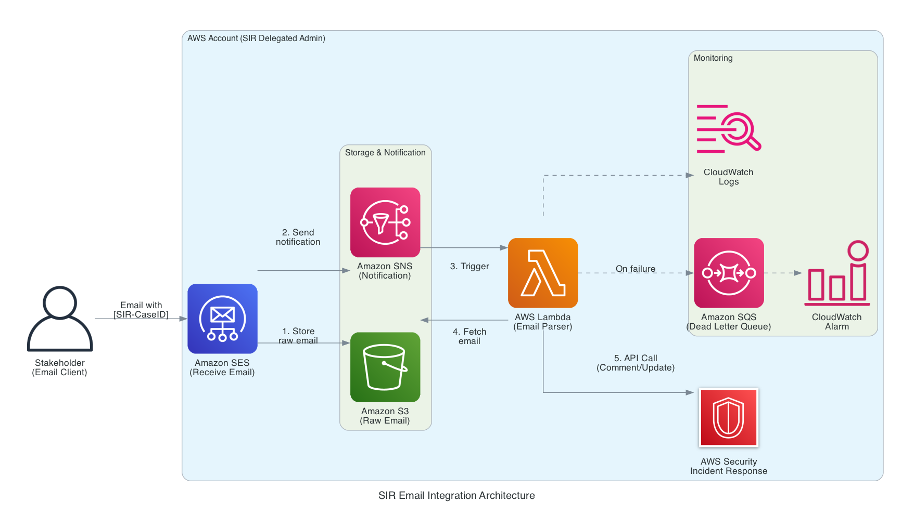

# AWS Security Incident Response — Email Integration

This project provides an email integration for [AWS Security Incident Response](https://aws.amazon.com/security-incident-response/),
enabling customers to update cases by sending emails instead of logging into the
AWS console. It extends the capabilities of the
[sample-aws-security-incident-response-integrations](https://github.com/aws-samples/sample-aws-security-incident-response-integrations)
project, which provides integrations for Jira, ServiceNow, and Slack.

AWS Security Incident Response helps you prepare for, respond to, and recover
from security events. During an active security event, reducing friction for
stakeholders to provide updates is important. Email is the lowest common
denominator — everyone has it, no onboarding required, and it provides a
natural audit trail. This integration allows executives, legal, compliance,
and external parties (outside counsel, forensics vendors) to contribute to
case management without needing AWS console access.

## Overview

This solution deploys a serverless pipeline that receives inbound emails via
Amazon SES, stores them in Amazon S3, and processes them with an AWS Lambda
function that calls the AWS Security Incident Response API. Stakeholders
include the SIR case ID in the email subject line, and the Lambda function
automatically adds comments, updates case details, or changes case status.

Key capabilities:

- Add comments to SIR cases by sending a plain email
- Update case status, description, or impacted accounts via structured keywords
- Sender verification against the case's watcher list, which helps prevent updates from unauthorized senders
- S3-based email storage to handle messages of any size
- Dead-letter queue with CloudWatch alarm for failed event monitoring
- TLS enforcement on all inbound email

## Architecture



1. Stakeholder sends an email with `[SIR-<case-id>]` in the subject line
2. Amazon SES receives the email and stores the raw content in Amazon S3
3. SES sends a lightweight notification to an Amazon SNS topic
4. SNS triggers the AWS Lambda function
5. Lambda fetches the full email from S3, parses it, verifies the sender
6. Lambda calls the appropriate SIR API (`CreateCaseComment`, `UpdateCase`, or `UpdateCaseStatus`)

Emails are automatically deleted from S3 after 7 days.

## Core AWS Services

| Service | Purpose |
|---------|---------|
| Amazon SES | Receives inbound email via receipt rules |
| Amazon S3 | Stores raw email content (avoids SNS size limits) |
| Amazon SNS | Delivers notifications from SES to Lambda |
| AWS Lambda | Parses email, verifies sender, calls SIR API |
| Amazon SQS | Dead-letter queue for failed event processing |
| Amazon CloudWatch | Logs and alarms for monitoring |
| AWS IAM | Least-privilege permissions for Lambda execution role |
| AWS CloudFormation (SAM) | Infrastructure as code for the entire stack |

## Domain Setup Guidance

### Use a subdomain, not your primary domain

Do not point your primary company domain's MX record to SES — this would redirect
all corporate email away from your existing mail provider (Microsoft 365, Google
Workspace, etc.).

Instead, use a dedicated subdomain:
- `sir.acme.com` or `security-ir.acme.com` instead of `acme.com`
- The subdomain's MX record points to SES
- The parent domain's email routing is unaffected
- Stakeholders send updates to `sir-cases@sir.acme.com`

### Email authentication (DMARC, DKIM, SPF)

DKIM is configured as part of Step 1 (domain verification) and is required
for all deployments. SPF, DMARC, and a custom MAIL FROM subdomain are only
needed if you also plan to send email from the domain (e.g., confirmation
replies). For receive-only deployments, DKIM + MX record is sufficient.

If you do plan to send email from the subdomain:

- Add an SPF record on the custom MAIL FROM subdomain (e.g., `mail.sir.acme.com`).
- Add a DMARC record at `_dmarc.sir.acme.com` with `p=reject`.
- If your parent domain has a strict DMARC policy (`p=reject`), the subdomain
  inherits it. Without proper DKIM/SPF on the subdomain, outbound emails from
  `sir.acme.com` may be rejected by recipients.

See [AWS SES DMARC compliance documentation](https://docs.aws.amazon.com/ses/latest/DeveloperGuide/send-email-authentication-dmarc.html)
for detailed setup instructions.

### DNS delegation

The subdomain records can be created directly in the parent domain's hosted zone,
or the subdomain can be delegated to a separate hosted zone (in the same or
different AWS account). In large enterprises, DNS changes may require approval
from a central IT or networking team — plan for this lead time.

### Receipt rule scoping

The SES receipt rule in this solution is scoped to a single recipient address
(e.g., `sir-cases@sir.acme.com`). Do not modify the rule to accept all recipients
on the subdomain — this could turn SES into an unintended open mail endpoint.
Always restrict receipt rules to the specific addresses you intend to process.

## Getting Started

### Prerequisites

- [AWS CLI v2](https://docs.aws.amazon.com/cli/latest/userguide/getting-started-install.html)
- [AWS SAM CLI](https://docs.aws.amazon.com/serverless-application-model/latest/developerguide/install-sam-cli.html)
- Python 3.12+
- A domain with DNS access (for SES email receiving)
- AWS Security Incident Response enabled in the target account
- Deploy in the account where SIR is active (delegated admin or management account)

### Step 1: Verify your domain in SES

SES email receiving is available in `us-east-1`, `us-west-2`, and `eu-west-1` only.

1. In the SES console (in the target region), go to **Identities → Create identity**
2. Select **Domain** and enter your domain name
3. Under DKIM, select **Easy DKIM** with a 2048-bit signing key
4. Click **Create identity**

SES will provide 3 CNAME records for DKIM. Add these to your DNS hosted zone:

```
<token1>._domainkey.<your-domain>  CNAME  <token1>.dkim.amazonses.com
<token2>._domainkey.<your-domain>  CNAME  <token2>.dkim.amazonses.com
<token3>._domainkey.<your-domain>  CNAME  <token3>.dkim.amazonses.com
```

Then add an MX record to route inbound email to SES:
```
<your-domain>  MX  10  inbound-smtp.<region>.amazonaws.com
```

Wait for the identity status to show **Verified** in the SES console:
```bash
aws sesv2 get-email-identity \
  --email-identity <your-domain> \
  --region <region>
```

### Step 2: Deploy the stack

```bash
cd sir-email-integration
./deploy.sh <your-domain> <recipient-address>
```

Examples:
```bash
# Using default AWS credentials
./deploy.sh example.com sir-cases@example.com

# Using a named profile
./deploy.sh example.com sir-cases@example.com --profile my-profile

# Using a specific region
AWS_REGION=us-west-2 ./deploy.sh example.com sir-cases@example.com
```

### Step 3: Activate the SES receipt rule set

Only one receipt rule set can be active per account per region.

```bash
aws ses set-active-receipt-rule-set \
  --rule-set-name sir-email-integration-rules \
  --region <region>
```

> **Note:** If you already have an active receipt rule set, you will need to
> add the receipt rule to your existing set instead, or deactivate the
> current one first.

## Usage

### Email Format

Include the SIR case ID in the subject line using the format `[SIR-<case-id>]`.
The email body determines the action taken.

#### Add a comment (default)
```
Subject: [SIR-1234567890] Any subject text here
Body: Your comment text goes here. This will be added as a case comment.
```

#### Update case status
```
Subject: [SIR-1234567890] Status update
Body:
ACTION: UPDATE_STATUS
STATUS: Detection and Analysis
```

Valid statuses: `Submitted`, `Detection and Analysis`,
`Containment, Eradication and Recovery`, `Post-incident Activities`

#### Update case description
```
Subject: [SIR-1234567890] Description update
Body:
ACTION: UPDATE_DESCRIPTION
DESCRIPTION: Updated description of the incident...
```

#### Add impacted accounts
```
Subject: [SIR-1234567890] Add accounts
Body:
ACTION: ADD_ACCOUNTS
ACCOUNTS: 123456789012, 234567890123
```

If no `ACTION` keyword is found in the body, the entire email body is posted
as a comment on the case.

## Testing

### Unit tests

```bash
pip install -r requirements.txt
python -m pytest tests/ -v
```

### End-to-end test (with domain)

Verify your sender email in SES if still in sandbox mode:
```bash
aws sesv2 create-email-identity \
  --email-identity <your-email> \
  --region <region>
```

Send a test email:
```bash
python tests/send_test_email.py \
  --case-id <sir-case-id> \
  --to <recipient-address> \
  --from <your-verified-email> \
  --comment "Testing email integration" \
  --region <region>
```

### End-to-end test (without domain)

Invoke the Lambda directly to test the full processing pipeline without
setting up SES email receiving:

```bash
aws lambda invoke \
  --function-name sir-email-handler \
  --region <region> \
  --cli-binary-format raw-in-base64-out \
  --payload '{
    "Records": [{
      "Sns": {
        "Message": "{\"content\": \"From: <watcher-email>\\r\\nTo: test@test.com\\r\\nSubject: [SIR-<case-id>] Test\\r\\nContent-Type: text/plain\\r\\n\\r\\nTest comment from email integration.\"}"
      }
    }]
  }' \
  /dev/stdout
```

> **Note:** The `From` address must match a watcher on the SIR case.

### Verify results

Check Lambda logs:
```bash
aws logs tail /aws/lambda/sir-email-handler --follow --region <region>
```

Then check the SIR case in the AWS console to confirm the comment or update
appeared.

## Troubleshooting

### Email not arriving at Lambda

- Verify the MX record points to `inbound-smtp.<region>.amazonaws.com`
  using `dig +short -t mx <your-domain>`
- Confirm the SES receipt rule set is active:
  `aws ses describe-active-receipt-rule-set --region <region>`
- Check that the recipient address in the receipt rule matches exactly
  (including case) the address you are sending to
- SES email receiving is only available in `us-east-1`, `us-west-2`, and
  `eu-west-1`. Verify you deployed in a supported region.

### Lambda invocation errors

- Check CloudWatch Logs: `aws logs tail /aws/lambda/sir-email-handler --region <region>`
- "No SIR case ID found in subject" — the email subject must contain
  `[SIR-<case-id>]` with a valid numeric case ID
- "Sender is not a watcher on case" — the `From` address must match a
  watcher email on the SIR case. Add the sender as a watcher via the
  SIR console or `UpdateCase` API.
- "Case not found or not accessible" — verify the case ID exists and that
  SIR is enabled in the account where the Lambda is deployed

### Message size errors

This solution stores emails in S3 to avoid SNS message size limits. If you
see size-related errors, verify the S3 bucket exists and the Lambda has
`s3:GetObject` permission on it.

### Failed events in the DLQ

Events that fail processing are sent to the SQS dead-letter queue. A
CloudWatch alarm triggers when messages appear in the DLQ.

To inspect failed events:
1. Navigate to the SQS console and find the `sir-email-integration-dlq` queue
2. Select "Send and receive messages" → "Poll for messages"
3. Examine the message content to understand the failure
4. Reprocess manually or fix the root cause and resend the email

### SES domain verification not completing

- Confirm the DKIM CNAME records are published:
  `dig +short -t cname <token>._domainkey.<your-domain>`
- DNS propagation can take up to 72 hours, though it typically completes
  within minutes
- If using a subdomain, ensure the records are in the correct hosted zone

## Security

### Sender Verification

The Lambda function verifies that the sender's email address matches a watcher
on the SIR case before processing any updates. Emails from senders not on the
watcher list are logged and discarded. This helps prevent unauthorized parties
from modifying case data, but does not replace broader email authentication
controls (DKIM, DMARC) on the sending domain.

For stronger sender assurance, customers should configure DMARC on their
sending domain. Without DMARC enforcement, the `From` header can be spoofed
to impersonate a legitimate watcher.

### Transport Encryption

The SES receipt rule enforces TLS (`TlsPolicy: Require`), ensuring that
inbound email is encrypted in transit. Emails sent without TLS are rejected
by SES.

### Least Privilege IAM

The Lambda execution role is scoped to only the SIR API actions required:
`security-ir:GetCase`, `security-ir:CreateCaseComment`,
`security-ir:UpdateCase`, `security-ir:UpdateCaseStatus`, and `s3:GetObject`
on the email storage bucket. No wildcard permissions are used beyond the
SIR resource scope.

### Encryption at Rest

The SNS topic and SQS dead-letter queue are encrypted using a customer-managed
KMS key created by the stack. The key policy grants SES permission to encrypt
notifications and Lambda permission to decrypt them. Key rotation is enabled
automatically. The S3 bucket uses server-side encryption with Amazon S3
managed keys (SSE-S3).

Failed events are captured in an SQS dead-letter queue. A CloudWatch alarm
triggers when messages appear in the DLQ, enabling rapid detection of
processing failures. All Lambda invocations are logged to CloudWatch Logs
with a 30-day retention period.

### Data Retention

Raw emails stored in S3 are automatically deleted after 7 days via an S3
lifecycle policy. Adjust the `ExpirationInDays` value in `template.yaml`
to meet your organization's data retention requirements.

## Frequently Asked Questions

**Q: Can I use my company's primary domain (e.g., `acme.com`)?**
A: It is not recommended. Changing the MX record on your primary domain would
redirect all corporate email to SES. Use a dedicated subdomain instead
(e.g., `sir.acme.com`). See [Domain Setup Guidance](#domain-setup-guidance).

**Q: What happens if the Lambda function fails to process an email?**
A: The event is sent to the SQS dead-letter queue, and a CloudWatch alarm
is triggered. The original email remains in S3 for 7 days, allowing you to
reprocess it after fixing the issue.

**Q: Can I deploy this integration in multiple AWS regions?**
A: Yes, but each region requires its own SES domain verification, MX record,
and stack deployment. SES email receiving is only available in `us-east-1`,
`us-west-2`, and `eu-west-1`.

**Q: What SIR API actions are supported?**
A: The integration supports `CreateCaseComment` (add comments),
`UpdateCase` (update description, add impacted accounts), and
`UpdateCaseStatus` (change case status). Additional actions can be added
by extending the Lambda function.

**Q: Which AWS account should this be deployed in?**
A: Deploy in the account where AWS Security Incident Response is active —
either the delegated administrator account or the management account. The
SIR API calls will fail if SIR is not enabled in the deployment account.

**Q: Can external parties (outside counsel, forensics vendors) use this?**
A: Yes, as long as they are added as watchers on the SIR case. The Lambda
verifies the sender's email against the case watcher list. No AWS account
or console access is required.

**Q: What is the maximum email size supported?**
A: Emails are stored in S3, so there is no practical size limit from the
SNS notification payload. SES itself supports messages up to 40 MB.

## Cleanup

Delete the CloudFormation stack:
```bash
aws cloudformation delete-stack \
  --stack-name sir-email-integration \
  --region <region>
```

If you created a dedicated domain for testing, remove the SES domain identity:
```bash
aws sesv2 delete-email-identity \
  --email-identity <your-domain> \
  --region <region>
```

## CI/CD (Optional)

Most users will deploy directly using `deploy.sh`. For automated deployments,
this repository includes pipeline configurations for both GitHub Actions and
GitLab CI.

### GitHub Actions

The workflow at `.github/workflows/deploy.yml` runs lint and tests on every PR,
and deploys on merge to `main`.

Setup:

1. Configure OIDC trust between GitHub and your AWS account
   ([guide](https://docs.github.com/en/actions/security-for-github-actions/security-hardening-your-deployments/configuring-openid-connect-in-amazon-web-services)).
   Create an IAM role that GitHub Actions can assume — no static access keys needed.

2. Add these secrets to your GitHub repo (Settings → Secrets and variables → Actions):
   - `AWS_DEPLOY_ROLE_ARN` — IAM role ARN for deployment
   - `SES_DOMAIN` — your verified SES domain
   - `RECIPIENT_ADDRESS` — email address for receiving SIR updates

3. Optionally, configure a `production` environment in GitHub (Settings → Environments)
   to require manual approval before deploys.

### GitLab CI

The pipeline at `.gitlab-ci.yml` has four stages: lint → test → build → deploy.

Setup:

1. Add CI/CD variables in GitLab (Settings → CI/CD → Variables):
   - `AWS_ACCESS_KEY_ID` and `AWS_SECRET_ACCESS_KEY` (or configure OIDC)
   - `SES_DOMAIN_STAGING` / `RECIPIENT_STAGING`
   - `SES_DOMAIN_PROD` / `RECIPIENT_PROD`

2. Deploy stages are manual — click "Play" in the pipeline to trigger staging
   or production.

### SES Domain Setup

Regardless of CI/CD method, SES domain verification and MX record configuration
is a one-time manual step. See [Getting Started — Step 1](#step-1-verify-your-domain-in-ses).

## Project Structure

```
sir-email-integration/
├── template.yaml                    # SAM/CloudFormation: SES → S3 → SNS → Lambda + DLQ
├── deploy.sh                        # Deployment script with SES verification check
├── lambda/
│   └── email_handler.py             # Email parsing, sender verification, SIR API calls
├── tests/
│   ├── test_email_handler.py        # Unit tests
│   └── send_test_email.py           # CLI tool to send test emails via SES
├── generated-diagrams/
│   └── sir_email_architecture.png   # Architecture diagram
├── .github/workflows/deploy.yml     # GitHub Actions pipeline
├── .gitlab-ci.yml                   # GitLab CI pipeline
├── requirements.txt
├── .gitignore
└── LICENSE
```

## License

This project is licensed under the MIT-0 License. See the [LICENSE](LICENSE) file for details.

## Contributing

We welcome contributions. Please open an issue or submit a pull request with
your proposed changes.
